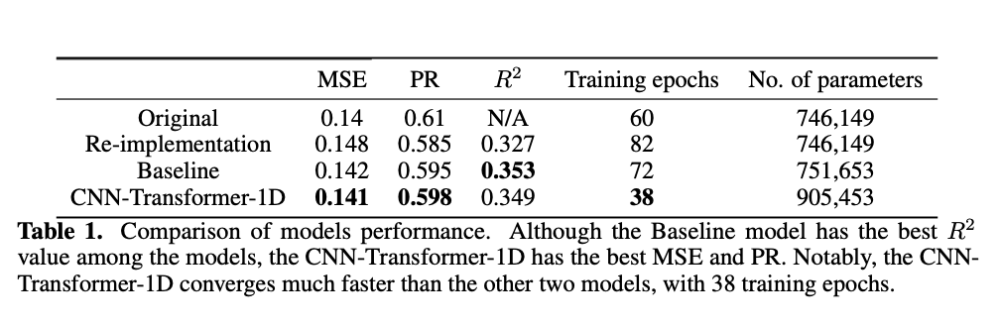

# Predicting 3D genome folding from DNA sequence and ATAC-Seq data
#### Author: Lichirui Zhang (lz2627)
## Project Introduction
In this project, we reproduced the paper, titled [“Akita, a CNN model for predicting 3D genome folding from DNA sequence.”](https://www.nature.com/articles/s41592-020-0958-x) and re-implemented the Akita Network, which is a convolutional neural network (CNN) that transforms input DNA sequence into predicted locus-specific genome folding. We then tried to improve the model performance in two ways: (1) leverage ATAC-Seq data, and (2) add Transformer encoder layers. Same as the original paper, we tested the performance on the held-out test dataset.


## Experiment Implementation
### 1. Re-implement the Akita Network and reproduce the related experiments
We firstly construct the Akita network and test it on the held-out test dataset. The hyper-parameters are the same as reported in the paper. Small tweaks: replace residual CNN blocks with "pre-activation" residual CNN blocks.

### 2. Augment the input with ATAC-Seq data
ATAC-Seq data was concatenated with corresponding DNA sequences. All the other settings are the same as experiment 1. 

### 3. Add Transformer encoder layers
Four additional Transformer encoder layers were added into the Akita network to help capture the long-range relationship. The encoder layers are implemented as the "pre-layernorm" variant to stablize training.

* The jupyter notebook './project.ipynb' contains the three experiments decribed above. 
* The script './custom_models.py' contains our own implementations of the models, modules, and helper functions used in the project.
* The directory './Datasets' contains all the datasets used in the project. './Datasets/get_data.sh' are used to get train, validation, test DNA sequences and Hi-C maps. './Datasets/Sample_0902.bed' contains ATAC-Seq reads.
* The directory './Figures' contains related figures such as training processes, model architecture inllustrations etc.
* The directory './checkpoints' contains trained weights.



## Project Dependencies
* Python 3.8.13
* Tensorflow 2.8.0
* Basenji

# Organization of this directory
```
.
├── Datasets
│   ├── Sample_0902.bed
│   └── get_data.sh
├── Figures
│   ├── MHA.pdf
│   ├── Residual_refine_1D:2D.pdf
│   ├── Transformer_encoder.pdf
│   ├── akita_architecture.png
│   ├── baseline_1.png
│   ├── baseline_2.png
│   ├── baseline_3.png
│   ├── model_overall.pdf
│   ├── orig_1.png
│   ├── orig_2.png
│   ├── orig_3.png
│   ├── re_imp_1.png
│   ├── re_imp_2.png
│   ├── re_imp_3.png
│   ├── residual_downsample_1d.pdf
│   ├── result.png
│   ├── transf_1.png
│   ├── transf_2.png
│   └── transf_3.png
├── README.md
├── checkpoints
│   ├── 20220501-121443.data-00000-of-00001
│   ├── 20220501-121443.index
│   ├── 20220501-211604.data-00000-of-00001
│   ├── 20220501-211604.index
│   ├── 20220502-090312.data-00000-of-00001
│   └── 20220502-090312.index
├── custom_models.py
└── project.ipynb

3 directories, 30 files
```
