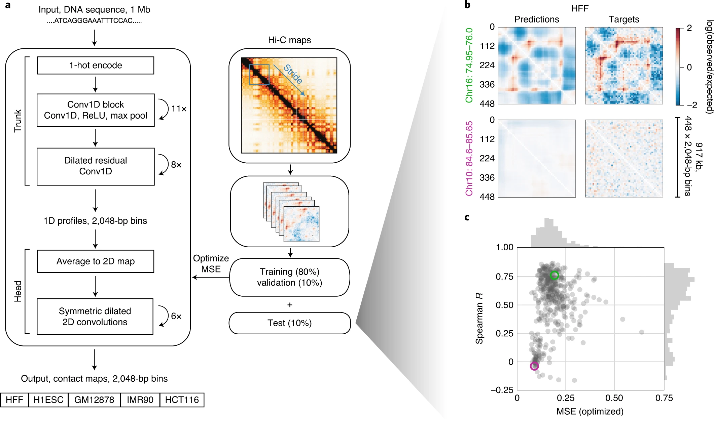

# Predicting 3D genome folding from DNA sequence and ATAC-Seq data
#### Author: Lichirui Zhang (lz2627)
## Project Introduction
In this project, we reproduced the paper, titled [“Akita, a CNN model for predicting 3D genome folding from DNA sequence.”](https://www.nature.com/articles/s41592-020-0958-x) and re-implemented the Akita Network, which is a convolutional neural network (CNN) that transforms input DNA sequence into predicted locus-specific genome folding, and tried to improve the performance in two ways: (1) leverage ATAC-Seq data, and (2) add Transformer encoder layers. Same as the original paper, we tested the performance on a held-out test dataset.

## Experiment Implementation
### 1. Construct the Akita Network and reproduce the related experiments
We firstly construct the Akita network and test it on the held-out test dataset. The hyper-parameters are the same as reported in the paper. Small tweaks: replace the residual CNN block with the "pre-activate" residual CNN block.

### 2. Augment the input with ATAC-Seq data
ATAC-Seq data was concatenated with DNA sequences. All the other settings are the same as step 1. 

### 3. Add Transformer encoder layers
Four Transformer encoder layers were added into the Akita network to help capture the long-range relationship. The encoder layers are implemented as the "pre-layernorm" variant to stablize training.

* The jupyter notebook './Notebooks/...' contains the three experiments decribed above. 
* The script './Notebooks/custom_models.py' contains our own implementations of the models/modules used in the project.
* The folder './Figures/' contains related figures such as training processes, model architecture inllustrations etc.

## Project Dependencies
* Python 3.6+
* Tensorflow 2.8.0
* Basenji
